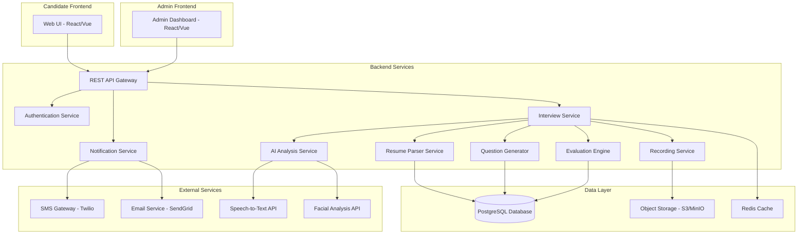

# Design Document

## Overview

SPEECH ANALYZER is a full-stack web application that automates the interview process for companies and organisations. The system is designed around two distinct interview tracks (TJI and NTJI), each with two sequential rounds. The architecture follows a modular design with clear separation between the candidate-facing frontend, the admin dashboard, and the backend services that handle resume parsing, question generation, answer evaluation, AI-based confidence analysis, and notification dispatch.

The system leverages AI/ML models for:
- Resume parsing (NLP-based entity extraction)
- Speech-to-text transcription for oral answers
- Facial expression analysis for composure evaluation
- Filler word detection in speech
- Keyword matching and semantic similarity for answer grading

The design prioritises scalability, maintainability, and testability. Each major component is designed to be independently testable and replaceable.

---

## Architecture

### High-Level Architecture



### Technology Stack

**Frontend:**
- React.js or Vue.js for UI
- WebRTC for video/audio capture
- Axios for API communication
- TailwindCSS for styling

**Backend:**
- Node.js with Express.js or Python with FastAPI
- PostgreSQL for relational data
- Redis for session management and caching
- MinIO or AWS S3 for video storage

**AI/ML Services:**
- OpenAI Whisper or Google Speech-to-Text for transcription
- Pre-trained facial expression recognition model (FER2013 or similar)
- spaCy or NLTK for keyword extraction and matching
- Sentence-BERT for semantic similarity scoring

**External Integrations:**
- Twilio for SMS
- SendGrid for email
- PDF parsing: PyPDF2 or pdfplumber
- DOCX parsing: python-docx

---

## Components and Interfaces

### 1. Candidate Frontend

**Responsibilities:**
- Display interview track selection (TJI/NTJI)
- Handle job role selection
- Resume upload interface
- Interview UI with question display, answer input (text/code editor/voice recording)
- Video/audio capture and streaming
- Display feedback messages and navigation

**Key Interfaces:**
- `GET /api/tracks` - Fetch available interview tracks
- `GET /api/roles?track={TJI|NTJI}` - Fetch job roles for a track
- `POST /api/resume/upload` - Upload resume
- `POST /api/interview/start` - Start an interview round
- `GET /api/interview/question` - Fetch next question
- `POST /api/interview/answer` - Submit answer
- `POST /api/interview/complete` - Complete interview round
- `POST /api/hr-round/verify-code` - Verify unique code for HR round access

### 2. Admin Dashboard

**Responsibilities:**
- Display all candidate records with filters (job role, track, status)
- Show detailed candidate evaluation (grades, confidence scores, recordings)
- Approve/reject candidates for HR round
- Approve/reject final candidates and trigger notifications
- Upload job offer letters

**Key Interfaces:**
- `GET /api/admin/candidates` - List all candidates with filters
- `GET /api/admin/candidate/:id` - Get detailed candidate record
- `POST /api/admin/candidate/:id/approve-initial` - Approve for HR round
- `POST /api/admin/candidate/:id/approve-final` - Approve final selection
- `POST /api/admin/candidate/:id/reject` - Reject candidate
- `GET /api/admin/recording/:id` - Stream interview recording

### 3. Resume Parser Service

**Responsibilities:**
- Parse PDF and DOCX resumes
- Extract structured data: name, phone, email, skills, experience, projects
- Validate extracted data
- Serialise and store parsed data

**Key Interfaces:**
```typescript
interface ResumeData {
  name: string;
  phone: string;
  email: string;
  skills: string[];
  experience: Experience[];
  projects: Project[];
}

interface Experience {
  company: string;
  role: string;
  duration: string;
  description: string;
}

interface Project {
  title: string;
  description: string;
  technologies: string[];
}

function parseResume(file: File): Promise<ResumeData>;
function serialiseResumeData(data: ResumeData): string;
function deserialiseResumeData(serialised: string): ResumeData;
```

### 4. Skill Matcher

**Responsibilities:**
- Compare candidate skills against job role requirements
- Determine if candidate is eligible for interview

**Key Interfaces:**
```typescript
interface JobRole {
  id: string;
  name: string;
  track: 'TJI' | 'NTJI';
  requiredSkills: string[];
  questionBankId: string;
}

function matchSkills(candidateSkills: string[], requiredSkills: string[]): {
  matched: string[];
  isEligible: boolean;
};
```

### 5. Question Generator

**Responsibilities:**
- Select questions from question bank based on job role and matched skills
- Generate question sets for initial rounds (Technical/Qualifying) and HR rounds
- Support question types: oral, code snippet

**Key Interfaces:**
```typescript
interface Question {
  id: string;
  type: 'oral' | 'code_snippet';
  text: string;
  skill: string;
  expectedAnswer: string;
  expectedKeywords: string[];
  codeTemplate?: string; // For code snippet questions
  language?: string; // Programming language for code questions
}

function generateQuestionSet(
  jobRoleId: string,
  matchedSkills: string[],
  roundType: 'technical' | 'qualifying' | 'hr',
  count: number
): Promise<Question[]>;
```

### 6. Evaluation Engine

**Responsibilities:**
- Evaluate oral answers using keyword matching
- Evaluate code snippet answers using static analysis or execution
- Assign grades (pass/poor)
- Track consecutive poor grades for early termination

**Key Interfaces:**
```typescript
interface Answer {
  questionId: string;
  candidateId: string;
  type: 'oral' | 'code_snippet';
  content: string; // Transcribed text or code
  timestamp: Date;
}

interface EvaluationResult {
  questionId: string;
  grade: 'pass' | 'poor';
  score: number; // 0-100
  matchedKeywords: string[];
  feedback: string;
}

function evaluateOralAnswer(
  answer: string,
  expectedKeywords: string[]
): EvaluationResult;

function evaluateCodeAnswer(
  code: string,
  expectedSolution: string,
  language: string
): EvaluationResult;

function shouldTerminateRound(
  evaluations: EvaluationResult[]
): boolean;
```

### 7. AI Analysis Service

**Responsibilities:**
- Transcribe audio to text using Speech-to-Text API
- Analyse facial expressions from video frames
- Detect filler words in transcribed speech
- Compute confidence score

**Key Interfaces:**
```typescript
interface ConfidenceAnalysis {
  composureScore: number; // 0-100
  fillerWordCount: number;
  fillerWords: string[];
  overallConfidenceScore: number; // 0-100
}

function transcribeAudio(audioBlob: Blob): Promise<string>;

function analyseFacialExpression(videoFrame: ImageData): Promise<{
  emotion: 'composed' | 'slightly_positive' | 'neutral' | 'distressed';
  confidence: number;
}>;

function detectFillerWords(transcribedText: string): {
  count: number;
  words: string[];
};

function computeConfidenceScore(
  composureScore: number,
  fillerWordCount: number
): number;
```

### 8. Recording Service

**Responsibilities:**
- Receive video/audio streams from frontend
- Store recordings in object storage
- Associate recordings with candidate and interview session

**Key Interfaces:**
```typescript
interface RecordingMetadata {
  candidateId: string;
  sessionId: string;
  jobRoleId: string;
  roundType: string;
  startTime: Date;
  endTime: Date;
  storageUrl: string;
}

function startRecording(sessionId: string): Promise<string>; // Returns recording ID
function stopRecording(recordingId: string): Promise<RecordingMetadata>;
function getRecordingUrl(recordingId: string): Promise<string>;
```

### 9. Notification Service

**Responsibilities:**
- Send SMS notifications via Twilio
- Send email notifications via SendGrid
- Generate unique codes for HR round access

**Key Interfaces:**
```typescript
function generateUniqueCode(): string;

function sendSMS(phoneNumber: string, message: string): Promise<void>;

function sendEmail(
  email: string,
  subject: string,
  body: string,
  attachments?: File[]
): Promise<void>;

function sendHRRoundCode(candidateId: string, code: string): Promise<void>;

function sendRejectionSMS(candidateId: string): Promise<void>;

function sendSelectionNotification(
  candidateId: string,
  offerLetter: File
): Promise<void>;
```

### 10. Interview Service (Orchestrator)

**Responsibilities:**
- Orchestrate the entire interview flow
- Manage interview state (current question, answer history, grades)
- Coordinate between Resume Parser, Question Generator, Evaluation Engine, AI Analysis, and Recording Service
- Implement 3-strike termination logic
- Compile round summaries

**Key Interfaces:**
```typescript
interface InterviewSession {
  id: string;
  candidateId: string;
  jobRoleId: string;
  track: 'TJI' | 'NTJI';
  roundType: 'technical' | 'qualifying' | 'hr';
  status: 'in_progress' | 'completed' | 'terminated';
  questions: Question[];
  answers: Answer[];
  evaluations: EvaluationResult[];
  confidenceAnalysis?: ConfidenceAnalysis;
  recordingId: string;
  currentQuestionIndex: number;
  consecutivePoorGrades: number;
}

function startInterview(
  candidateId: string,
  jobRoleId: string,
  roundType: string
): Promise<InterviewSession>;

function getNextQuestion(sessionId: string): Promise<Question | null>;

function submitAnswer(
  sessionId: string,
  answer: Answer
): Promise<EvaluationResult>;

function completeInterview(sessionId: string): Promise<{
  summary: RoundSummary;
  finalGrade: number;
}>;
```

---

## Data Models

### Database Schema

**Candidates Table**
```sql
CREATE TABLE candidates (
  id UUID PRIMARY KEY,
  name VARCHAR(255) NOT NULL,
  email VARCHAR(255) NOT NULL,
  phone VARCHAR(20) NOT NULL,
  resume_data JSONB NOT NULL,
  job_role_id UUID NOT NULL,
  track VARCHAR(10) NOT NULL, -- 'TJI' or 'NTJI'
  unique_code VARCHAR(20) UNIQUE,
  status VARCHAR(50) NOT NULL, -- 'pending_initial', 'pending_hr', 'approved', 'rejected'
  created_at TIMESTAMP DEFAULT NOW(),
  FOREIGN KEY (job_role_id) REFERENCES job_roles(id)
);
```

**Job Roles Table**
```sql
CREATE TABLE job_roles (
  id UUID PRIMARY KEY,
  name VARCHAR(255) NOT NULL,
  track VARCHAR(10) NOT NULL,
  required_skills TEXT[] NOT NULL,
  question_bank_id UUID NOT NULL,
  created_at TIMESTAMP DEFAULT NOW()
);
```

**Interview Sessions Table**
```sql
CREATE TABLE interview_sessions (
  id UUID PRIMARY KEY,
  candidate_id UUID NOT NULL,
  job_role_id UUID NOT NULL,
  round_type VARCHAR(20) NOT NULL, -- 'technical', 'qualifying', 'hr'
  status VARCHAR(20) NOT NULL, -- 'in_progress', 'completed', 'terminated'
  questions JSONB NOT NULL,
  answers JSONB NOT NULL,
  evaluations JSONB NOT NULL,
  confidence_analysis JSONB,
  recording_id UUID,
  final_grade DECIMAL(5,2),
  started_at TIMESTAMP DEFAULT NOW(),
  completed_at TIMESTAMP,
  FOREIGN KEY (candidate_id) REFERENCES candidates(id),
  FOREIGN KEY (job_role_id) REFERENCES job_roles(id)
);
```

**Questions Table**
```sql
CREATE TABLE questions (
  id UUID PRIMARY KEY,
  question_bank_id UUID NOT NULL,
  type VARCHAR(20) NOT NULL, -- 'oral', 'code_snippet'
  text TEXT NOT NULL,
  skill VARCHAR(100) NOT NULL,
  expected_answer TEXT NOT NULL,
  expected_keywords TEXT[] NOT NULL,
  code_template TEXT,
  language VARCHAR(50),
  created_at TIMESTAMP DEFAULT NOW()
);
```

**Recordings Table**
```sql
CREATE TABLE recordings (
  id UUID PRIMARY KEY,
  candidate_id UUID NOT NULL,
  session_id UUID NOT NULL,
  storage_url TEXT NOT NULL,
  duration_seconds INT,
  file_size_bytes BIGINT,
  created_at TIMESTAMP DEFAULT NOW(),
  FOREIGN KEY (candidate_id) REFERENCES candidates(id),
  FOREIGN KEY (session_id) REFERENCES interview_sessions(id)
);
```

---


---

## Correctness Properties

*A property is a characteristic or behavior that should hold true across all valid executions of a system-essentially, a formal statement about what the system should do. Properties serve as the bridge between human-readable specifications and machine-verifiable correctness guarantees.*

---

**Property 1: Skill eligibility correctness**
*For any* candidate skills list and job role required skills list, the system should return `isEligible = true` if and only if the intersection of the two lists is non-empty. When the intersection is empty, the system should return `isEligible = false`.
**Validates: Requirements 2.3, 2.4**

---

**Property 2: Resume data persistence round-trip**
*For any* parsed ResumeData object, storing it to the database and then retrieving it by candidate ID should produce an object equivalent to the original.
**Validates: Requirements 2.5**

---

**Property 3: Question generation relevance**
*For any* job role and set of matched skills, every question in the generated question set should have its `skill` field set to a value that is present in the matched skills set.
**Validates: Requirements 3.1, 5.1, 10.1**

---

**Property 4: Question set composition**
*For any* generated Technical Round question set of size >= 2, the set should contain at least one question of type `oral` and at least one question of type `code_snippet`.
**Validates: Requirements 3.2**

---

**Property 5: Keyword matching grading**
*For any* oral answer and expected keywords list, the evaluation function should assign a `pass` grade when the proportion of matched keywords exceeds the passing threshold, and a `poor` grade when the proportion falls below the poor grade threshold. The score should be a value between 0 and 100 inclusive.
**Validates: Requirements 3.3, 5.3, 10.2, 10.4, 10.5**

---

**Property 6: Three-strike termination**
*For any* sequence of evaluation results where the last three consecutive results all have grade `poor`, the `shouldTerminateRound` function should return `true`. For any sequence where the last three consecutive results do not all have grade `poor`, the function should return `false`.
**Validates: Requirements 3.5, 5.4**

---

**Property 7: Session summary completeness**
*For any* completed or terminated interview session, the stored session summary should contain exactly the same number of questions, answers, and evaluations as were processed during the session, with no entries missing or duplicated.
**Validates: Requirements 3.7, 5.6, 6.3**

---

**Property 8: Unique code uniqueness**
*For any* batch of N unique codes generated by the system, all N codes should be distinct from each other and from any previously generated codes stored in the database.
**Validates: Requirements 4.1**

---

**Property 9: Unique code verification**
*For any* code that exists in the system and is associated with an approved candidate, the verification function should return `true`. For any code that does not exist in the system or is associated with a non-approved candidate, the verification function should return `false`.
**Validates: Requirements 4.3, 4.4**

---

**Property 10: HR question personalisation**
*For any* candidate resume containing at least one experience entry or project, the generated HR question set should contain at least one question whose text references a term from the candidate's experience or project data.
**Validates: Requirements 6.1**

---

**Property 11: Final grade computation bounds**
*For any* initial round grade and HR round grade, both in the range [0, 100], the computed final grade should also be in the range [0, 100] and should be a deterministic function of the two input grades (same inputs always produce the same output).
**Validates: Requirements 6.4**

---

**Property 12: Composure classification validity**
*For any* video frame input to the facial expression analyser, the returned composure classification should be exactly one of the four valid values: `composed`, `slightly_positive`, `neutral`, or `distressed`.
**Validates: Requirements 7.1**

---

**Property 13: Filler word detection accuracy**
*For any* transcribed text string containing a known number of filler words from the defined filler word list, the `detectFillerWords` function should return a count equal to the actual number of filler word occurrences in the text.
**Validates: Requirements 7.2**

---

**Property 14: Confidence score monotonicity**
*For any* two composure states where state A is ranked higher than state B (composed > slightly_positive > neutral > distressed), the confidence score for state A should be greater than or equal to the confidence score for state B. Similarly, for any two filler word counts where count A is less than count B, the confidence score for count A should be greater than or equal to the confidence score for count B.
**Validates: Requirements 7.3, 7.4**

---

**Property 15: Confidence score inclusion in grade**
*For any* completed round that includes confidence analysis, the round's overall grade should differ from a grade computed without confidence analysis, confirming the confidence score has a non-zero weight in the final grade formula.
**Validates: Requirements 7.5**

---

**Property 16: Recording association correctness**
*For any* completed interview session, the stored recording metadata should reference the correct `candidateId` and `jobRoleId` that were associated with that session, and the `storageUrl` should be a non-empty string pointing to a retrievable resource.
**Validates: Requirements 8.2, 8.3**

---

**Property 17: Candidate record availability**
*For any* candidate who has completed or been terminated from an initial round, querying the admin API for candidates should return a record for that candidate containing the job role, round summary, grades, and recording reference.
**Validates: Requirements 9.1**

---

**Property 18: Passing candidate classification**
*For any* set of candidates with varying final grades, the admin dashboard query should classify exactly those candidates whose grade is greater than or equal to the passing threshold as "Passing Candidates", and no others.
**Validates: Requirements 9.2**

---

**Property 19: Resume serialisation round-trip**
*For any* valid ResumeData object, serialising it to the internal data format and then deserialising the result should produce an object that is structurally and value-equivalent to the original.
**Validates: Requirements 11.2, 11.3**

---

**Property 20: Resume parser completeness**
*For any* valid PDF or DOCX resume file, the parser should return a ResumeData object where all required fields (`name`, `phone`, `email`, `skills`, `experience`, `projects`) are present and non-null.
**Validates: Requirements 11.1**

---

## Error Handling

### Resume Upload Errors
- Unsupported file format → return HTTP 400 with message listing supported formats (PDF, DOCX)
- File too large → return HTTP 413 with max file size in message
- Parsing failure → return HTTP 422 with a generic parse error message; log the full error server-side

### Skill Match Failure
- No skills matched → return a structured response with `isEligible: false` and a user-facing message; do not expose internal skill lists

### Interview Session Errors
- Session not found → return HTTP 404
- Answer submitted after session termination → return HTTP 409 (Conflict)
- Invalid question index → return HTTP 400

### Unique Code Errors
- Invalid code → return HTTP 401 with a generic "Invalid or expired code" message
- Code already used → return HTTP 409

### Notification Errors
- SMS delivery failure → log the failure, retry up to 3 times with exponential backoff, mark notification as failed in DB if all retries exhausted
- Email delivery failure → same retry strategy as SMS

### AI Service Errors
- Speech-to-text failure → fall back to text input mode; log the failure
- Facial analysis failure → skip confidence scoring for that frame; do not terminate the session
- If confidence analysis is unavailable for the entire session → compute grade without confidence component; flag in the session record

### Recording Errors
- Storage upload failure → retry up to 3 times; if all fail, mark recording as unavailable in DB and alert admin

---

## Testing Strategy

### Overview

The system uses a dual testing approach: unit tests for specific examples and edge cases, and property-based tests for universal correctness properties. Both are required and complementary.

### Property-Based Testing

**Library:** `fast-check` (TypeScript/JavaScript) or `hypothesis` (Python), depending on the chosen backend language.

Each property-based test must:
- Run a minimum of 100 iterations
- Be tagged with a comment in the format: `**Feature: speech-analyzer, Property {N}: {property_text}**`
- Reference the correctness property number from this design document
- Use smart generators that constrain inputs to valid domains (e.g., skills lists are non-empty arrays of strings, grades are numbers in [0, 100])

**Properties to implement as PBT:**
- P1: Skill eligibility correctness
- P2: Resume data persistence round-trip
- P3: Question generation relevance
- P4: Question set composition
- P5: Keyword matching grading
- P6: Three-strike termination
- P7: Session summary completeness
- P8: Unique code uniqueness
- P9: Unique code verification
- P10: HR question personalisation
- P11: Final grade computation bounds
- P12: Composure classification validity
- P13: Filler word detection accuracy
- P14: Confidence score monotonicity
- P15: Confidence score inclusion in grade
- P16: Recording association correctness
- P17: Candidate record availability
- P18: Passing candidate classification
- P19: Resume serialisation round-trip
- P20: Resume parser completeness

### Unit Tests

Unit tests cover:
- Specific resume parsing examples (known PDF/DOCX fixtures)
- Code snippet evaluation with known correct and incorrect code samples
- Admin approval workflow triggering correct notifications (with mocked SMS/email services)
- Unique code generation format validation
- Error handling paths (unsupported file format, invalid code, session not found)
- UI rendering: landing page shows both tracks, job role screen shows required skills

### Integration Tests

Integration tests cover:
- Full interview flow from resume upload to round completion (TJI and NTJI)
- Admin approval triggering SMS dispatch
- HR round access via unique code end-to-end
- Recording storage and retrieval

### Test Organisation

```
tests/
  unit/
    resume-parser.test.ts
    skill-matcher.test.ts
    evaluation-engine.test.ts
    question-generator.test.ts
    notification-service.test.ts
    unique-code.test.ts
  property/
    skill-eligibility.property.test.ts
    resume-roundtrip.property.test.ts
    question-generation.property.test.ts
    keyword-grading.property.test.ts
    termination-logic.property.test.ts
    session-summary.property.test.ts
    unique-code-uniqueness.property.test.ts
    confidence-scoring.property.test.ts
    grade-computation.property.test.ts
    filler-word-detection.property.test.ts
    recording-association.property.test.ts
    candidate-classification.property.test.ts
  integration/
    tji-flow.integration.test.ts
    ntji-flow.integration.test.ts
    admin-approval.integration.test.ts
    hr-round-access.integration.test.ts
```
